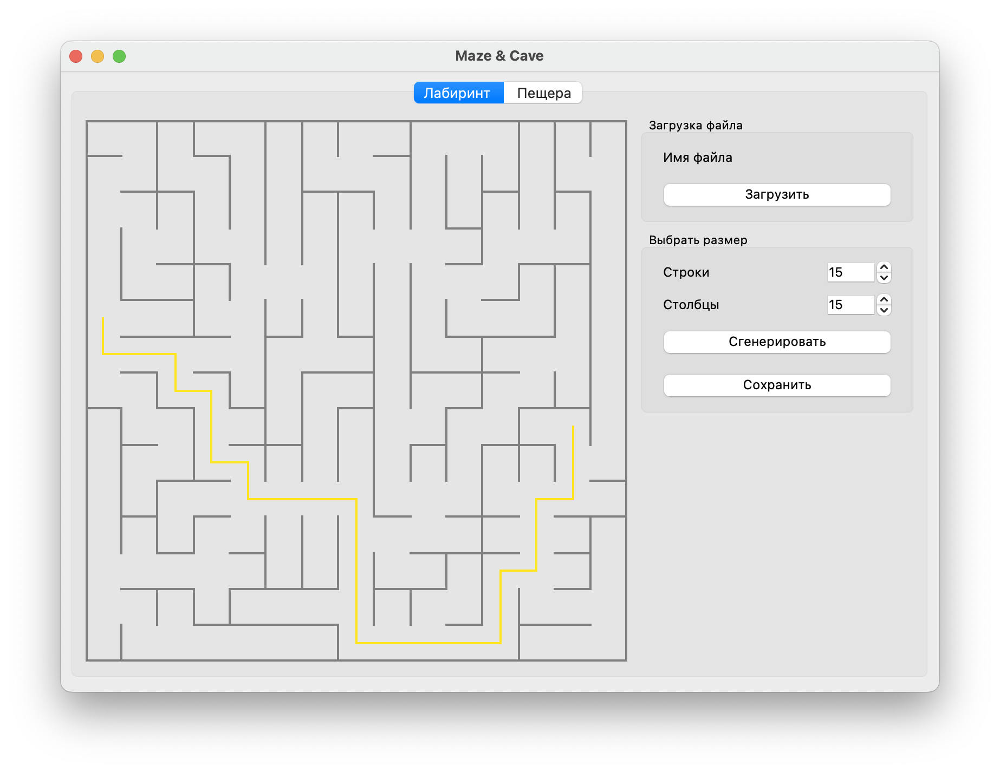
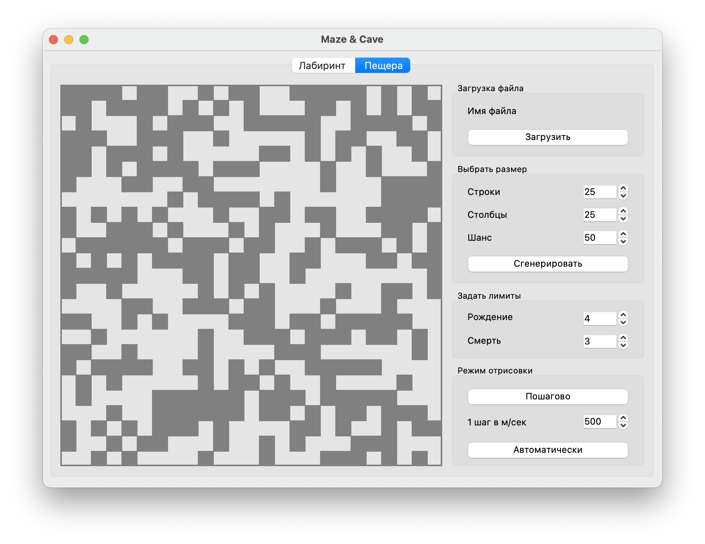

# Maze/Cave

В этом проекте реализованы генерация идеального лабиринта и генерация пещер с использованием клеточного автомата.
Графический пользовательский интерфейс созданы на базе GUI-библиотеки Qt.

## Лабиринт (Maze)

Идеальный лабиринт - это лабиринт, в котором отсутствуют петли, недостижимые пространства и путь из одной точки в другую всегда один.

Максимальный размер лабиринта - 50 х 50 (поддерживается не «квадратная» генерация).
Лабиринт также можно загрузить из файла.

Поиск кратчайшего пути задается кнопками мыши. Левая кнопка - начальная точка, правая - конечная.

## Пещеры (Cave)

Алгоритм генерации пещер очень похож на игру «Жизнь».
Задаются правила «рождения»/«смерти» клеток в зависимости от находящихся рядом «соседей».
Если «живые» клетки окружены «живыми» клетками, количество которых меньше, чем предел «смерти», они «умирают». 
Аналогично если «мертвые» клетки находятся рядом с «живыми», количество которых больше, чем предел «рождения», они становятся «живыми».

Пределы «рождения» и «смерти» могут иметь значения от 0 до 7.
Предусмотрен пошаговый режим отрисовки результатов работы алгоритма в двух вариантах:
  - По нажатию на кнопку следующего шага отрисовывается очередная итерация работы алгоритма
  - По нажатию на кнопку автоматической работы запускается отрисовка итераций работы алгоритма с частотой 1 шаг в `N` миллисекунд

